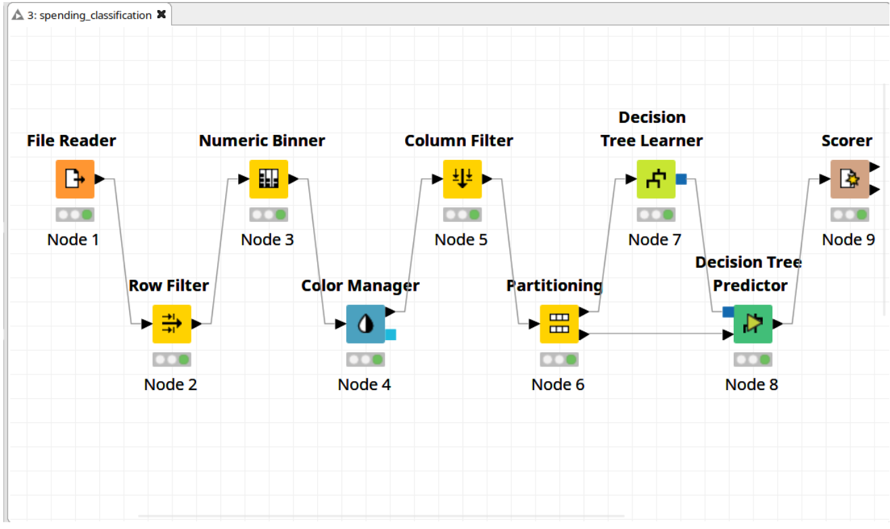

# Classification

Suppose we label players who spend 5$ or more as HighRollers, and the rest as PennyPinchers.  
Our **Goal** is to build a Decision Tree to predict if an unknown user would be a HighRoller or a PennyPincher.  
Then study the built Decision Tree to see what factors predict if a User will drive **Revenues**.

## Steps:
 1. [Data Preparation](1%20Data%20Preparation.pdf):  
   Binning ```avg_price``` into 2 categories and selecting attributes for Classification.

 2. [Modelling Decision Tree](2%20Partitioning%20and%20Modeling.pdf):  
   Splitting our Dataset into Test and Train Dataset.  
   And building the decision tree. 

 3. [Evaluation](3%20Evaluation.pdf):  
   Evaluate the accuracy and Confusion Matrix of the Tree.

 4. [Conclusion](4%20Conclusions.pdf):  
   Takes a broader look at the workflow and provides Recommendations to increase Revenue.


